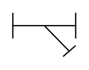

# Y-Type Strainer

## Definition

```
{
  _style: { 
    entity: 'verticalLabelPosition=bottom;align=center;dashed=0;html=1;verticalAlign=top;shape=mxgraph.pid.piping.y-type_strainer;pointerEvents=1;',
  },
  _original_width: 50,
  _original_height: 35,
}
```

## Usage

```
import { YTypeStrainer } from '@diac/standard-components-diagrams/procEngPiping'

<YTypeStrainer/>
```

## Preview


