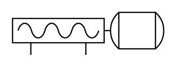

# Cavity Pump

## Definition

```
{
  _style: 'shape=mxgraph.pid.pumps.cavity_pump;html=1;pointerEvents=1;align=center;verticalLabelPosition=bottom;verticalAlign=top;dashed=0;',
  _width: 123,
  _height: 35,
}
```

## Usage

```
import { CavityPump } from '@reactiac/standard-components-diagrams/procEngPumps'

<CavityPump/>
```

## Preview


