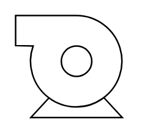

# Gas Blower

## Definition

```
{
  _style: 'shape=mxgraph.pid.pumps.gas_blower;html=1;pointerEvents=1;align=center;verticalLabelPosition=bottom;verticalAlign=top;dashed=0;',
  _width: 72,
  _height: 67,
}
```

## Usage

```
import { GasBlower } from '@reactiac/standard-components-diagrams/procEngPumps'

<GasBlower/>
```

## Preview


