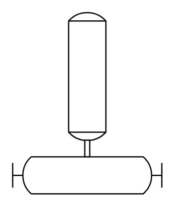

# Vertical Pump

## Definition

```
{
  _style: { 
    entity: 'shape=mxgraph.pid.pumps.vertical_pump;html=1;pointerEvents=1;align=center;verticalLabelPosition=bottom;verticalAlign=top;dashed=0;',
  },
  _original_width: 120,
  _original_height: 146,
}
```

## Usage

```
import { VerticalPump } from '@dinghy/standard-components-diagrams/procEngPumps'

<VerticalPump/>
```

## Preview


