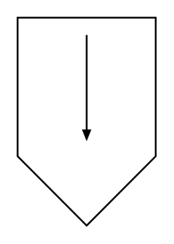
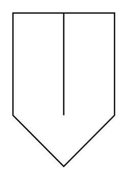
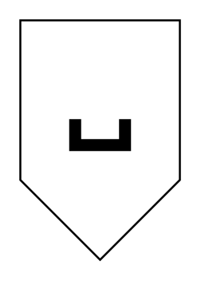
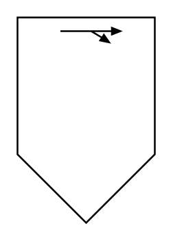

# Proc Eng Separators Entities

- [GravitySeparatorSettlingChamber](./gravity-separator-settling-chamber.md)  

- [ImpactSeparator](./impact-separator.md)  

- [SeparatorCyclone](./separator-cyclone.md)  

- [SeparatorElectromagnetic](./separator-electromagnetic.md)  

- [SeparatorElectrostaticPrecipitatorWet](./separator-electrostatic-precipitator-wet.md)  

- [SeparatorElectrostaticPrecipitator](./separator-electrostatic-precipitator.md)  

- [SeparatorPermanentMagnet](./separator-permanent-magnet.md)  

- [SeparatorVenturiScrubber](./separator-venturi-scrubber.md)  

- [SeparatorWetScrubber](./separator-wet-scrubber.md)  

- [SeparatorSifter](./separator-sifter.md)  

- [SolidifierClosed](./solidifier-closed.md)  

- [SolidifierOpen](./solidifier-open.md)  

- [SprayScrubber](./spray-scrubber.md)  

