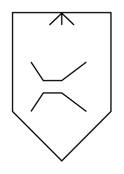

# Separator (Venturi Scrubber)

## Definition

```
{
  _style: { 
    entity: 'verticalLabelPosition=bottom;align=center;dashed=0;html=1;verticalAlign=top;shape=mxgraph.pid.separators.separator_(venturi_scrubber);',
  },
  _original_width: 80,
  _original_height: 120,
}
```

## Usage

```
import { SeparatorVenturiScrubber } from '@diac/standard-components-diagrams/procEngSeparators'

<SeparatorVenturiScrubber/>
```

## Preview


