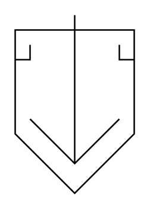

# Solidifier (Closed)

## Definition

```
{
  _style: 'verticalLabelPosition=bottom;align=center;dashed=0;html=1;verticalAlign=top;shape=mxgraph.pid.separators.solidifier_(closed);',
  _width: 80,
  _height: 120,
}
```

## Usage

```
import { SolidifierClosed } from '@reactiac/standard-components-diagrams/procEngSeparators'

<SolidifierClosed/>
```

## Preview


