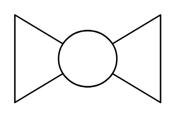

# Ball Valve

## Definition

```
{
  _style: 'verticalLabelPosition=bottom;align=center;html=1;verticalAlign=top;pointerEvents=1;dashed=0;shape=mxgraph.pid2valves.valve;valveType=ball',
  _width: 100,
  _height: 60,
}
```

## Usage

```
import { BallValve } from '@diac/standard-components-diagrams/procEngValves'

<BallValve/>
```

## Preview


