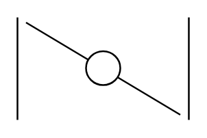

# Butterfly Valve

## Definition

```
{
  _style: { 
    entity: 'verticalLabelPosition=bottom;align=center;html=1;verticalAlign=top;pointerEvents=1;dashed=0;shape=mxgraph.pid2valves.valve;valveType=butterfly',
  },
  _original_width: 100,
  _original_height: 60,
}
```

## Usage

```
import { ButterflyValve } from '@dinghy/standard-components-diagrams/procEngValves'

<ButterflyValve/>
```

## Preview


