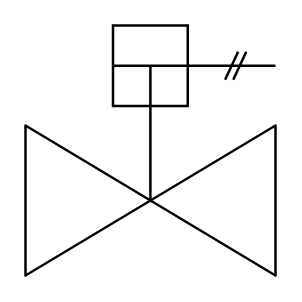

# Gate Valve (Single Acting Cylinder)

## Definition

```
{
  _style: { 
    entity: 'verticalLabelPosition=bottom;align=center;html=1;verticalAlign=top;pointerEvents=1;dashed=0;shape=mxgraph.pid2valves.valve;valveType=gate;actuator=singActing',
  },
  _width: 60,
  _height: 60,
}
```

## Usage

```
import { GateValveSingleActingCylinder } from '@diac/standard-components-diagrams/procEngValves'

<GateValveSingleActingCylinder/>
```

## Preview


