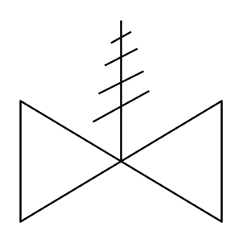

# Gate Valve (Spring)

## Definition

```
{
  _style: { 
    entity: 'verticalLabelPosition=bottom;align=center;html=1;verticalAlign=top;pointerEvents=1;dashed=0;shape=mxgraph.pid2valves.valve;valveType=gate;actuator=spring',
  },
  _original_width: 100,
  _original_height: 100,
}
```

## Usage

```
import { GateValveSpring } from '@diac/standard-components-diagrams/procEngValves'

<GateValveSpring/>
```

## Preview


