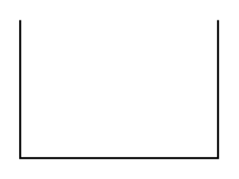

# Container, Tank, Cistern

## Definition

```
{
  _style: { 
    entity: 'shape=mxgraph.pid.vessels.container,_tank,_cistern;html=1;pointerEvents=1;align=center;verticalLabelPosition=bottom;verticalAlign=top;dashed=0;',
  },
  _original_width: 100,
  _original_height: 70,
}
```

## Usage

```
import { ContainerTankCistern } from '@dinghy/standard-components-diagrams/procEngVessels'

<ContainerTankCistern/>
```

## Preview


