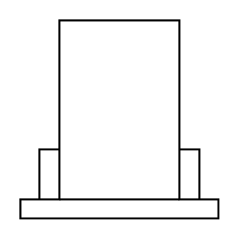

# Forced-Draft Cooling Tower

## Definition

```
{
  _style: 'shape=mxgraph.pid.vessels.forced-draft_cooling_tower;html=1;pointerEvents=1;align=center;verticalLabelPosition=bottom;verticalAlign=top;dashed=0;',
  _width: 60,
  _height: 60,
}
```

## Usage

```
import { ForcedDraftCoolingTower } from '@diac/standard-components-diagrams/procEngVessels'

<ForcedDraftCoolingTower/>
```

## Preview


