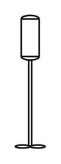

# Mixer

## Definition

```
{
  _style: { 
    entity: 'shape=mxgraph.pid.vessels.mixer;html=1;pointerEvents=1;align=center;verticalLabelPosition=bottom;verticalAlign=top;dashed=0;',
  },
  _original_width: 20,
  _original_height: 88,
}
```

## Usage

```
import { Mixer } from '@diac/standard-components-diagrams/procEngVessels'

<Mixer/>
```

## Preview


