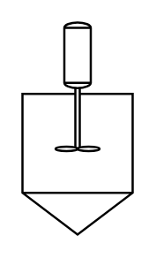

# Mixing Reactor

## Definition

```
{
  _style: { 
    entity: 'shape=mxgraph.pid.vessels.mixing_reactor;html=1;pointerEvents=1;align=center;verticalLabelPosition=bottom;verticalAlign=top;dashed=0;',
  },
  _original_width: 50,
  _original_height: 96,
}
```

## Usage

```
import { MixingReactor } from '@dinghy/standard-components-diagrams/procEngVessels'

<MixingReactor/>
```

## Preview


