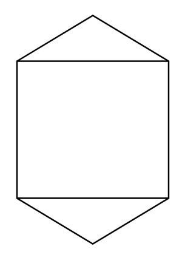

# Tank (Conical Roof and Bottom)

## Definition

```
{
  _style: 'shape=mxgraph.pid.vessels.tank_(conical_roof_and_bottom);html=1;pointerEvents=1;align=center;verticalLabelPosition=bottom;verticalAlign=top;dashed=0;',
  _width: 101,
  _height: 150,
}
```

## Usage

```
import { TankConicalRoofAndBottom } from '@reactiac/standard-components-diagrams/procEngVessels'

<TankConicalRoofAndBottom/>
```

## Preview


