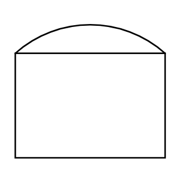

# Tank (Dished Roof)

## Definition

```
{
  _style: { 
    entity: 'shape=mxgraph.pid.vessels.tank_(dished_roof);html=1;pointerEvents=1;align=center;verticalLabelPosition=bottom;verticalAlign=top;dashed=0;',
  },
  _width: 100,
  _height: 95,
}
```

## Usage

```
import { TankDishedRoof } from '@diac/standard-components-diagrams/procEngVessels'

<TankDishedRoof/>
```

## Preview


