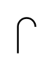

# Vent (Bent)

## Definition

```
{
  _style: 'shape=mxgraph.pid.vessels.vent_(bent);html=1;pointerEvents=1;align=center;verticalLabelPosition=bottom;verticalAlign=top;dashed=0;',
  _width: 10,
  _height: 20,
}
```

## Usage

```
import { VentBent } from '@diac/standard-components-diagrams/procEngVessels'

<VentBent/>
```

## Preview


