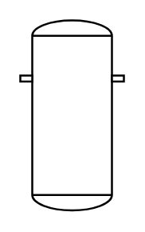

# Vessel (Dished Ends, Ring)

## Definition

```
{
  _style: 'shape=mxgraph.pid.vessels.vessel_(dished_ends,_ring);html=1;pointerEvents=1;align=center;verticalLabelPosition=bottom;verticalAlign=top;dashed=0;',
  _width: 52,
  _height: 95,
}
```

## Usage

```
import { VesselDishedEndsRing } from '@diac/standard-components-diagrams/procEngVessels'

<VesselDishedEndsRing/>
```

## Preview


