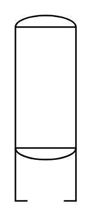

# Vessel (Dished Ends, Skirts)

## Definition

```
{
  _style: 'shape=mxgraph.pid.vessels.vessel_(dished_ends,_skirts);html=1;pointerEvents=1;align=center;verticalLabelPosition=bottom;verticalAlign=top;dashed=0;',
  _width: 40,
  _height: 122,
}
```

## Usage

```
import { VesselDishedEndsSkirts } from '@diac/standard-components-diagrams/procEngVessels'

<VesselDishedEndsSkirts/>
```

## Preview


