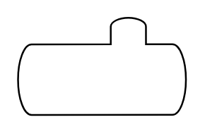

# Vessel (Dome)

## Definition

```
{
  _style: { 
    entity: 'shape=mxgraph.pid.vessels.vessel_(dome);html=1;pointerEvents=1;align=center;verticalLabelPosition=bottom;verticalAlign=top;dashed=0;',
  },
  _width: 95,
  _height: 55,
}
```

## Usage

```
import { VesselDome } from '@diac/standard-components-diagrams/procEngVessels'

<VesselDome/>
```

## Preview


