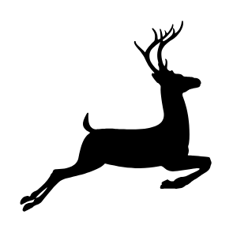
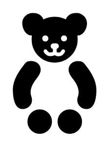

# Signs Animals Entities

- [Bear1](./bear-1.md)  

- [Bear2](./bear-2.md)  

- [Deer1](./deer-1.md)  

- [Deer2](./deer-2.md)  

- [DogOnLeash](./dog-on-leash.md)  

- [Duck](./duck.md)  

- [FishHatchery](./fish-hatchery.md)  

- [Kennel](./kennel.md)  

- [Moose](./moose.md)  

- [NoDogs](./no-dogs.md)  

- [Seal](./seal.md)  

- [Sloth](./sloth.md)  

- [Snake](./snake.md)  

- [Stable](./stable.md)  

- [TeddyBear](./teddy-bear.md)  

