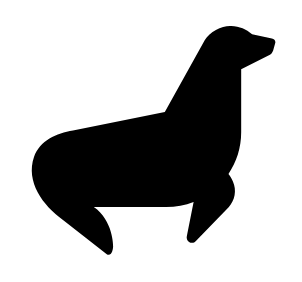

# Seal

## Definition

```
{
  _style: 'shape=mxgraph.signs.animals.seal;html=1;pointerEvents=1;fillColor=#000000;strokeColor=none;verticalLabelPosition=bottom;verticalAlign=top;align=center;sketch=0;',
  _width: 100,
  _height: 92,
}
```

## Usage

```
import { Seal } from '@diac/standard-components-diagrams/signsAnimals'

<Seal/>
```

## Preview


