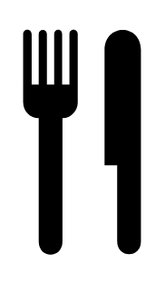

# Restaurant 2

## Definition

```
{
  _style: 'shape=mxgraph.signs.food.restaurant_2;html=1;pointerEvents=1;fillColor=#000000;strokeColor=none;verticalLabelPosition=bottom;verticalAlign=top;align=center;sketch=0;',
  _width: 52,
  _height: 104,
}
```

## Usage

```
import { Restaurant2 } from '@reactiac/standard-components-diagrams/signsFood'

<Restaurant2/>
```

## Preview


