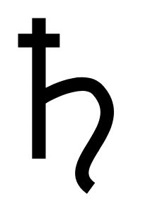

# Saturn

## Definition

```
{
  _style: 'shape=mxgraph.signs.nature.saturn;html=1;pointerEvents=1;fillColor=#000000;strokeColor=none;verticalLabelPosition=bottom;verticalAlign=top;align=center;sketch=0;',
  _width: 60,
  _height: 99,
}
```

## Usage

```
import { Saturn } from '@diac/standard-components-diagrams/signsNature'

<Saturn/>
```

## Preview


