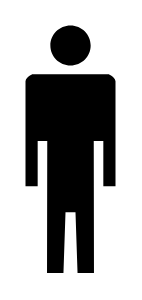

# Man 2

## Definition

```
{
  _style: 'shape=mxgraph.signs.people.man_2;html=1;pointerEvents=1;fillColor=#000000;strokeColor=none;verticalLabelPosition=bottom;verticalAlign=top;align=center;sketch=0;',
  _width: 36,
  _height: 99,
}
```

## Usage

```
import { Man2 } from '@reactiac/standard-components-diagrams/signsPeople'

<Man2/>
```

## Preview


