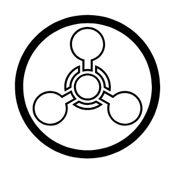
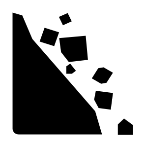
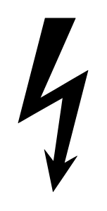
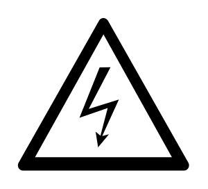
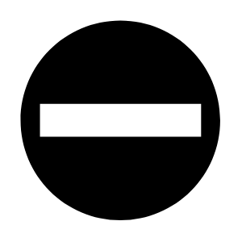
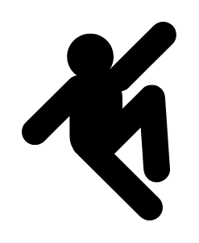

# Signs Safety Entities

- [Biohazard](./biohazard.md)  

- [Caution](./caution.md)  

- [ChemicalWeapon](./chemical-weapon.md)  

- [FallingRocks](./falling-rocks.md)  

- [FalloutShelter](./fallout-shelter.md)  

- [Fragile](./fragile.md)  

- [HandleWithCare](./handle-with-care.md)  

- [HighVoltage1](./high-voltage-1.md)  

- [HighVoltage2](./high-voltage-2.md)  

- [HighVoltage3](./high-voltage-3.md)  

- [KeepDry](./keep-dry.md)  

- [No](./no.md)  

- [NoEntry](./no-entry.md)  

- [NoSmoking](./no-smoking.md)  

- [NonIonizingRadiation](./non-ionizing-radiation.md)  

- [PedestrianCrossing](./pedestrian-crossing.md)  

- [Radiation](./radiation.md)  

- [SlipHazard](./slip-hazard.md)  

- [StoreRightUp1](./store-right-up-1.md)  

- [StoreRightUp2](./store-right-up-2.md)  

