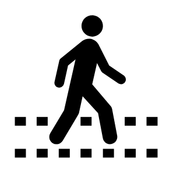

# Pedestrian Crossing

## Definition

```
{
  _style: { 
    entity: 'shape=mxgraph.signs.safety.pedestrian_crossing;html=1;pointerEvents=1;fillColor=#000000;strokeColor=none;verticalLabelPosition=bottom;verticalAlign=top;align=center;sketch=0;',
  },
  _width: 60,
  _height: 60,
}
```

## Usage

```
import { PedestrianCrossing } from '@diac/standard-components-diagrams/signsSafety'

<PedestrianCrossing/>
```

## Preview


