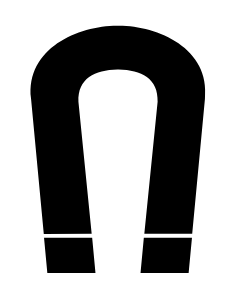

# Magnet

## Definition

```
{
  _style: { 
    entity: 'shape=mxgraph.signs.science.magnet;html=1;pointerEvents=1;fillColor=#000000;strokeColor=none;verticalLabelPosition=bottom;verticalAlign=top;align=center;sketch=0;',
  },
  _original_width: 74,
  _original_height: 99,
}
```

## Usage

```
import { Magnet } from '@diac/standard-components-diagrams/signsScience'

<Magnet/>
```

## Preview


