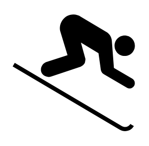

# Downhill Skiing 1

## Definition

```
{
  _style: { 
    entity: 'shape=mxgraph.signs.sports.downhill_skiing_1;html=1;pointerEvents=1;fillColor=#000000;strokeColor=none;verticalLabelPosition=bottom;verticalAlign=top;align=center;sketch=0;',
  },
  _original_width: 99,
  _original_height: 97,
}
```

## Usage

```
import { DownhillSkiing1 } from '@diac/standard-components-diagrams/signsSports'

<DownhillSkiing1/>
```

## Preview


