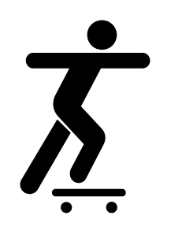

# Skateboarding

## Definition

```
{
  _style: { 
    entity: 'shape=mxgraph.signs.sports.skateboarding;html=1;pointerEvents=1;fillColor=#000000;strokeColor=none;verticalLabelPosition=bottom;verticalAlign=top;align=center;sketch=0;',
  },
  _original_width: 66,
  _original_height: 98,
}
```

## Usage

```
import { Skateboarding } from '@dinghy/standard-components-diagrams/signsSports'

<Skateboarding/>
```

## Preview


