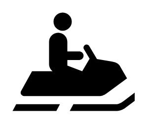

# Snowmobile

## Definition

```
{
  _style: 'shape=mxgraph.signs.sports.snowmobile;html=1;pointerEvents=1;fillColor=#000000;strokeColor=none;verticalLabelPosition=bottom;verticalAlign=top;align=center;sketch=0;',
  _width: 99,
  _height: 80,
}
```

## Usage

```
import { Snowmobile } from '@diac/standard-components-diagrams/signsSports'

<Snowmobile/>
```

## Preview


