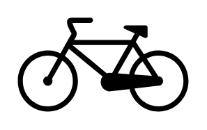

# Bicycle 5

## Definition

```
{
  _style: 'shape=mxgraph.signs.transportation.bicycle_5;html=1;pointerEvents=1;fillColor=#000000;strokeColor=none;verticalLabelPosition=bottom;verticalAlign=top;align=center;sketch=0;',
  _width: 98,
  _height: 54,
}
```

## Usage

```
import { Bicycle5 } from '@diac/standard-components-diagrams/signsTransportation'

<Bicycle5/>
```

## Preview


