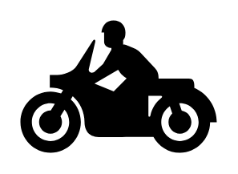

# Motorcycle

## Definition

```
{
  _style: { 
    entity: 'shape=mxgraph.signs.transportation.motorcycle;html=1;pointerEvents=1;fillColor=#000000;strokeColor=none;verticalLabelPosition=bottom;verticalAlign=top;align=center;sketch=0;',
  },
  _original_width: 98,
  _original_height: 66,
}
```

## Usage

```
import { Motorcycle } from '@dinghy/standard-components-diagrams/signsTransportation'

<Motorcycle/>
```

## Preview


