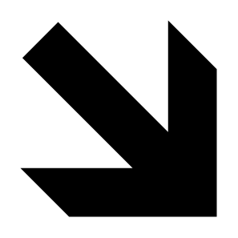

# Arrow SE

## Definition

```
{
  _style: 'shape=mxgraph.signs.travel.arrow_se;html=1;pointerEvents=1;fillColor=#000000;strokeColor=none;verticalLabelPosition=bottom;verticalAlign=top;align=center;sketch=0;',
  _width: 98,
  _height: 98,
}
```

## Usage

```
import { ArrowSe } from '@reactiac/standard-components-diagrams/signsTravel'

<ArrowSe/>
```

## Preview


