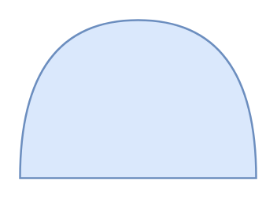

# AND Gate

## Definition

```
{
  _style: { 
    entity: 'shape=or;whiteSpace=wrap;html=1;direction=north;fillColor=#dae8fc;strokeColor=#6c8ebf;',
  },
  _original_width: 120,
  _original_height: 80,
}
```

## Usage

```
import { AndGate } from '@diac/standard-components-diagrams/threatModeling'

<AndGate/>
```

## Preview


