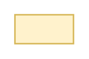

# Asset Label

## Definition

```
{
  _style: { 
    entity: 'text;html=1;strokeColor=#d6b656;fillColor=#fff2cc;align=center;verticalAlign=middle;whiteSpace=wrap;overflow=hidden;',
  },
  _original_width: 40,
  _original_height: 20,
}
```

## Usage

```
import { AssetLabel } from '@diac/standard-components-diagrams/threatModeling'

<AssetLabel/>
```

## Preview


