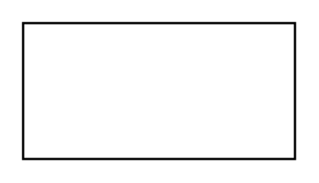

# External Entity

## Definition

```
{
  _style: { 
    entity: 'rounded=0;whiteSpace=wrap;html=1;',
  },
  _width: 120,
  _height: 60,
}
```

## Usage

```
import { ExternalEntity } from '@diac/standard-components-diagrams/threatModeling'

<ExternalEntity/>
```

## Preview


