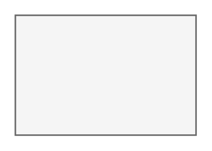

# Leaf Node

## Definition

```
{
  _style: { 
    entity: 'rounded=0;whiteSpace=wrap;html=1;fillColor=#f5f5f5;strokeColor=#666666;',
  },
  _original_width: 120,
  _original_height: 80,
}
```

## Usage

```
import { LeafNode } from '@diac/standard-components-diagrams/threatModeling'

<LeafNode/>
```

## Preview


