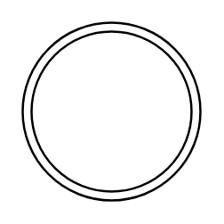

# Multi-Process

## Definition

```
{
  _style: 'ellipse;shape=doubleEllipse;whiteSpace=wrap;html=1;aspect=fixed;',
  _width: 80,
  _height: 80,
}
```

## Usage

```
import { MultiProcess } from '@reactiac/standard-components-diagrams/threatModeling'

<MultiProcess/>
```

## Preview


