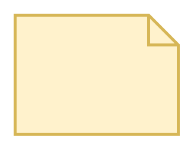

# Note

## Definition

```
{
  _style: 'shape=note;strokeWidth=2;fontSize=14;size=20;whiteSpace=wrap;html=1;fillColor=#fff2cc;strokeColor=#d6b656;fontColor=#666600;',
  _width: 110.00000000000001,
  _height: 80,
}
```

## Usage

```
import { Note } from '@reactiac/standard-components-diagrams/threatModeling'

<Note/>
```

## Preview


