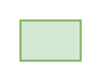

# Security Control Label

## Definition

```
{
  _style: { 
    entity: 'text;html=1;strokeColor=#82b366;fillColor=#d5e8d4;align=center;verticalAlign=middle;whiteSpace=wrap;overflow=hidden;',
  },
  _original_width: 30,
  _original_height: 20,
}
```

## Usage

```
import { SecurityControlLabel } from '@dinghy/standard-components-diagrams/threatModeling'

<SecurityControlLabel/>
```

## Preview


