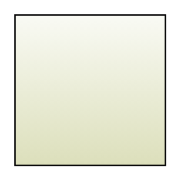

# Bookmarks.fr

## Definition

```
{
  _style: { 
    entity: 'dashed=0;outlineConnect=0;html=1;align=center;labelPosition=center;verticalLabelPosition=bottom;verticalAlign=top;shape=mxgraph.webicons.bookmarks.fr;fillColor=#F9FAF4;gradientColor=#DCDFBB',
  },
  _original_width: 102.4,
  _original_height: 102.4,
}
```

## Usage

```
import { BookmarksFr } from '@dinghy/standard-components-diagrams/webIcons'

<BookmarksFr/>
```

## Preview


