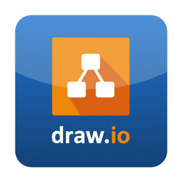

# draw.io

## Definition

```
{
  _style: { 
    entity: 'dashed=0;outlineConnect=0;html=1;align=center;labelPosition=center;verticalLabelPosition=bottom;verticalAlign=top;shape=mxgraph.webicons.drawio2;fillColor=#2174CE;gradientColor=#134277',
  },
  _original_width: 102.4,
  _original_height: 102.4,
}
```

## Usage

```
import { DrawIo } from '@diac/standard-components-diagrams/webIcons'

<DrawIo/>
```

## Preview


