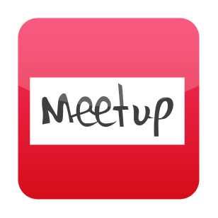

# Meetup

## Definition

```
{
  _style: 'dashed=0;outlineConnect=0;html=1;align=center;labelPosition=center;verticalLabelPosition=bottom;verticalAlign=top;shape=mxgraph.webicons.meetup;fillColor=#F83263;gradientColor=#D40D19',
  _width: 102.4,
  _height: 102.4,
}
```

## Usage

```
import { Meetup } from '@reactiac/standard-components-diagrams/webIcons'

<Meetup/>
```

## Preview


