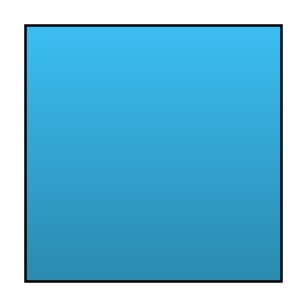

# Spring.me

## Definition

```
{
  _style: 'dashed=0;outlineConnect=0;html=1;align=center;labelPosition=center;verticalLabelPosition=bottom;verticalAlign=top;shape=mxgraph.webicons.spring.me;fillColor=#3CBEF2;gradientColor=#2B8AAF',
  _width: 102.4,
  _height: 102.4,
}
```

## Usage

```
import { SpringMe } from '@diac/standard-components-diagrams/webIcons'

<SpringMe/>
```

## Preview


