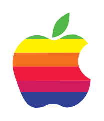

# Apple (classic)

## Definition

```
{
  _style: 'dashed=0;outlineConnect=0;html=1;align=center;labelPosition=center;verticalLabelPosition=bottom;verticalAlign=top;shape=mxgraph.weblogos.apple_classic',
  _width: 62.400000000000006,
  _height: 76.2,
}
```

## Usage

```
import { AppleClassic } from '@reactiac/standard-components-diagrams/webLogos'

<AppleClassic/>
```

## Preview


