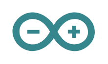

# Arduino

## Definition

```
{
  _style: 'dashed=0;outlineConnect=0;html=1;align=center;labelPosition=center;verticalLabelPosition=bottom;verticalAlign=top;shape=mxgraph.weblogos.arduino;fillColor=#36868D;strokeColor=none',
  _width: 67.4,
  _height: 32,
}
```

## Usage

```
import { Arduino } from '@reactiac/standard-components-diagrams/webLogos'

<Arduino/>
```

## Preview


