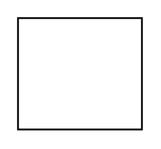

# Bookmarks.fr

## Definition

```
{
  _style: 'dashed=0;outlineConnect=0;html=1;align=center;labelPosition=center;verticalLabelPosition=bottom;verticalAlign=top;shape=mxgraph.weblogos.bookmarks.fr',
  _width: 70.2,
  _height: 62.800000000000004,
}
```

## Usage

```
import { BookmarksFr } from '@reactiac/standard-components-diagrams/webLogos'

<BookmarksFr/>
```

## Preview


