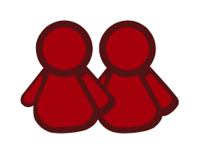

# Buddymarks

## Definition

```
{
  _style: { 
    entity: 'dashed=0;outlineConnect=0;html=1;align=center;labelPosition=center;verticalLabelPosition=bottom;verticalAlign=top;shape=mxgraph.weblogos.buddymarks',
  },
  _original_width: 79.4,
  _original_height: 57,
}
```

## Usage

```
import { Buddymarks } from '@dinghy/standard-components-diagrams/webLogos'

<Buddymarks/>
```

## Preview


